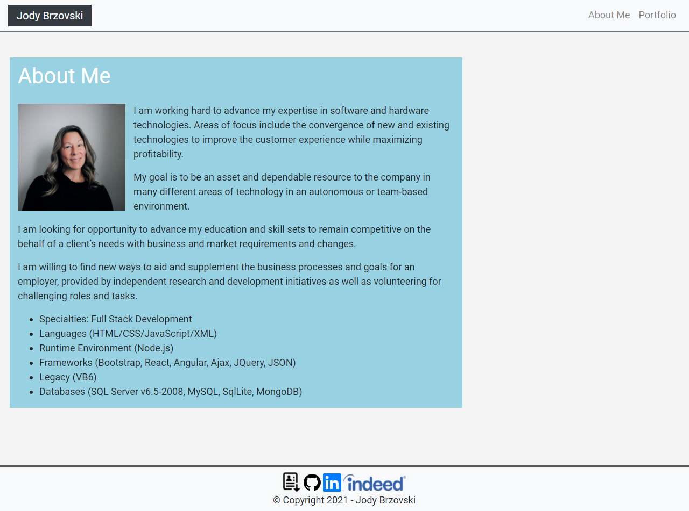

# my-portfolio
My portfolio website: A showcase of sample projects

# Mock-up

# Link to live site
[Jody Brzovski Portfolio](https://jodybrzo.github.io/my-portfolio/index.html)

## Why I made this site
I created this portfolio website to showcase my sample projects and skillset.  I also made this site to show my skills with the bootstrap grid system to create a responsive website.

## What I learned
I learned so much while coding this website.  I had a lot of fun learning and understanding how to use the bootstrap grid system and bootstrap classes all while incorporating new features like a stick footer and responsive design.  I also learned how to use an html validator to check my code for errors.

## Challenges 
I faced several challenges working on this site.  I was having a very hard time understanding how the bootstrap classes worked so that I could have the text links on the navbar be aligned to the right.  Once I gained an understanding of the bootstrap classes and grid system then things started to fall into place and become a little easier. Overall, the whole site was a challenge for me to create because these technologies are new to me. I am looking forward to continuing to update this site as time goes on with more completed projects and implemented technologies.

## License
All code on this site is copyrighted Jody Brzovski - 2020 

